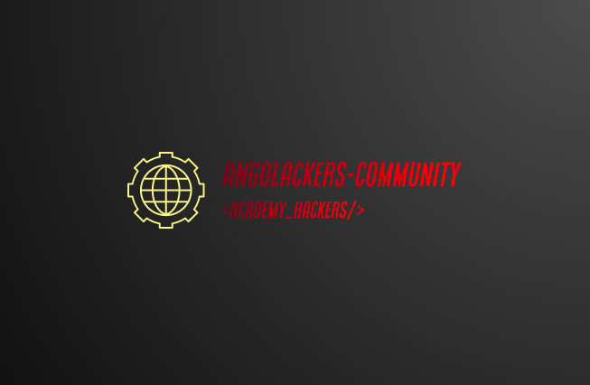

# ngolackers

|creating a little blog using Django-Framework|
|---|
|criando um pequeno blog usando Django-Framework|

---

## *English*

> to run the program \
open your terminal (prompt-commands) and type: \
$ `mkdir Angolackers_Academy` \
$ `cd Angolackers_Academy` \
$ `git clone https://github.com/Angolackers-Academy/bloGC.git` \
then: \
$ `cd bloGC` \
$ `python3 ./manage.py runserver` \
and finally open your browser at the address: `http://127.0.0.1:8000/`

## *Português*

> Para a execução do programa \
abra o seu terminal (prompt-comandos) e digite: \
$ `mkdir Angolackers_Academy` \
$ `cd Angolackers_Academy` \
$ `git clone https://github.com/Angolackers-Academy/bloGC.git` \
em seguida: \
$ `cd bloGC` \
$ `python3 ./manage.py runserver` \
e por fim abra o seu navegador no endereço: `http://127.0.0.1:8000/`

---

&copy; 2021 [Angolackers Academy](https://angolackers-academy.github.io/intro) \
&trade; [ArtesGC](https://artesgc.home.blog)
